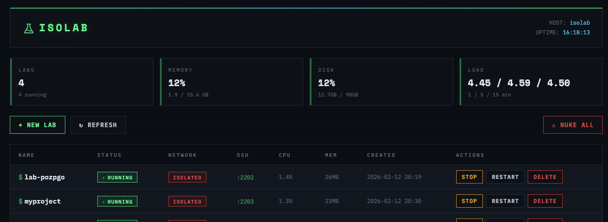

<p align="center">
  
</p>

<h1 align="center">Isolab</h1>

<p align="center"><strong>Disposable, sandboxed development environments for LLM agent work.</strong></p>

<p align="center">
  Isolab lets you spin up isolated Linux containers on your own hardware so AI coding agents (Claude Code, Aider, Cursor, etc.) can run freely without risking your local machine. Default to zero network access. Tear it down when you're done. Nothing escapes.
</p>

```
isolab create myproject              # fully isolated, no network
isolab create webdev --net=packages  # can install from pypi/npm only
isolab ssh myproject                 # drops you into a persistent tmux session
isolab rm myproject                  # gone forever
```

<p align="center">
  
</p>

## Why

LLM coding agents run arbitrary code with your user permissions. One prompt injection, one malicious dependency, and your SSH keys, credentials, and files are exposed. Isolab puts agents on a physically separate machine inside network-isolated containers with [gVisor](https://gvisor.dev) syscall interception — so even a fully compromised container has no path to your data.

## Features

- **gVisor isolation** — every container runs under `runsc`, intercepting all syscalls at the kernel boundary
- **Three network modes** — `none` (default, zero network), `packages` (pypi/npm/github only), `full` (unrestricted)
- **SSH proxy** — SSH to port 2222 and a container is auto-provisioned for you, no `create` step needed
- **Multi-key SSH management** — add keys from multiple machines with `isolab keys add`, sync to all running labs
- **tmux session persistence** — SSH drops you into a named tmux session; disconnect and reconnect without losing state
- **Session logging** — all terminal output captured to `~/logs/` automatically
- **Retro dashboard** — web UI for managing containers, viewing host stats, one-click create/stop/delete
- **Login banner** — MOTD shows network mode, memory, and disk at a glance so you always know your threat posture
- **Disk watchdog** — warns via tmux notification when containers approach capacity
- **Developer tools built in** — Starship prompt, uv, direnv, ripgrep, bat, fd, tmux with vim keys

## Requirements

- A spare x86_64 machine (or VM) with 8GB+ RAM
- Ubuntu Server 24.04 LTS
- [Tailscale](https://tailscale.com) or [Cloudflare Tunnels](https://developers.cloudflare.com/cloudflare-one/connections/connect-networks/) for remote access
- An SSH keypair on your main machine

## Quick Start

### 1. Install the base system

Flash Ubuntu Server 24.04 to your spare machine. Enable OpenSSH during install.

### 2. Clone and run setup

```bash
git clone https://github.com/mikemott/isolab.git
cd isolab
./setup.sh
```

The setup script launches an **interactive wizard** that walks you through mode selection (Quick vs Full), component toggles, and installation with live progress. Use arrow keys to navigate, space to toggle options, and Enter to confirm.

For non-interactive use (CI, piped input), pass `--auto` for Quick Setup defaults:

```bash
./setup.sh --auto
```

The script is idempotent — safe to run multiple times. Quick Setup installs Docker, gVisor, builds the container image, configures the restricted network, and installs the CLI. Full Setup adds system hardening, UFW firewall, SSH hardening, Tailscale, and automatic security updates.

**Tailscale Setup:** If you select Tailscale during Full Setup, you can provide an auth key to automate authentication:

```bash
export TAILSCALE_AUTHKEY="tskey-auth-xxxxx"
./setup.sh
```

Generate auth keys at https://login.tailscale.com/admin/settings/keys. Without an auth key, setup will install Tailscale but skip authentication — you'll need to run `sudo tailscale up --ssh` manually after setup completes.

### 3. Add your SSH keys

```bash
isolab keys add ~/.ssh/id_ed25519.pub                    # local key
isolab keys add "ssh-ed25519 AAAA... user@remote-mac"    # paste a remote key
isolab keys list                                          # see configured keys
```

### 4. Create your first sandbox

```bash
isolab create test --net=none
isolab ssh test
```

You'll land in a tmux session inside an isolated container. Run `netcheck` to confirm network is blocked.

### 5. Or just SSH in (auto-provision)

If you installed the SSH proxy, containers are created on demand:

```bash
ssh -p 2222 mike@your-isolab-host            # auto-creates a lab
ssh -p 2222 mike@your-isolab-host myproject   # creates/connects to "myproject"
```

For a detailed manual walkthrough, see [docs/full-guide.md](docs/full-guide.md).

## Usage

```
isolab create <name> [--net=none|packages|full]   Create a new sandbox
isolab list                                        List all sandboxes
isolab ssh <name>                                  SSH in (auto-attaches tmux)
isolab stop <name>                                 Stop (tmux sessions preserved)
isolab start <name>                                Start a stopped sandbox
isolab rm <name>                                   Remove permanently
isolab logs <name>                                 View session logs
isolab nuke                                        Destroy ALL sandboxes
isolab keys add <key|file>                         Add an SSH public key
isolab keys list                                   List configured keys
isolab keys rm <index>                             Remove a key by index
isolab keys sync [name]                            Push keys to running labs
isolab install-proxy                               Install SSH proxy (port 2222)
```

### Network Modes

| Mode | Flag | Access | Use Case |
|------|------|--------|----------|
| **Isolated** | `--net=none` (default) | No network at all | Safe agent execution, code review |
| **Packages** | `--net=packages` | Ports 80/443/53 only | Installing dependencies |
| **Full** | `--net=full` | Unrestricted | Web scraping, API calls |

### SSH Proxy

The SSH proxy listens on port 2222 and auto-provisions containers when users connect. Install it with:

```bash
sudo isolab install-proxy
```

Each connecting SSH key is mapped to its own container. Pass a name as the SSH command to target a specific lab:

```bash
ssh -p 2222 mike@isolab-host              # auto-assigned name from key fingerprint
ssh -p 2222 mike@isolab-host myproject    # creates/connects to "myproject"
```

### Web Dashboard

If you enabled the dashboard during setup, it runs automatically at **http://localhost:8080** (or via Tailscale at `http://your-hostname:8080`).

The dashboard provides:
- Create/start/stop/delete labs with a GUI
- View CPU, memory, and disk usage
- See all SSH connection info
- One-click access to container logs

**Install the dashboard:**
```bash
sudo ~/isolab/scripts/install-dashboard.sh
```

**Manage the dashboard service:**
```bash
sudo systemctl status isolab-dashboard   # Check status
sudo systemctl restart isolab-dashboard  # Restart
sudo systemctl stop isolab-dashboard     # Stop
```

**Security note**: The dashboard has no authentication. Only expose it via Tailscale or localhost — never directly to the internet.

### Tips

- **Default to `--net=none`** and only escalate when you need to install packages
- **Never mount host volumes** — copy files with `scp -P <port> file sandbox@host:~/workspace/`
- **Inject API keys as env vars** at container creation, never bake them into images
- **Snapshot good environments** with `docker commit iso-myproject isolab:myproject-snapshot`
- **Adjust resources** by editing `--memory` and `--cpus` in `isolab.sh` (defaults: 4GB, 2 CPUs)

## Project Structure

```
isolab/
├── README.md
├── setup.sh                    # Automated setup (./setup.sh --help)
├── isolab.sh                   # CLI entry point
├── assets/
│   └── flask.svg               # Project icon (Phosphor flask)
├── image/
│   ├── Dockerfile              # Sandbox base image
│   ├── entrypoint.sh           # SSH + env setup
│   ├── tmux.conf               # Session persistence + logging
│   ├── bashrc                  # Auto-attach, aliases, starship
│   ├── starship.toml           # Prompt config
│   ├── motd.sh                 # Login banner with network status
│   └── disk-watchdog.sh        # Capacity warning cron
├── dashboard/
│   └── app.py                  # Flask web UI
├── scripts/
│   ├── setup-networks.sh       # Restricted Docker network
│   ├── isolab-authkeys         # SSH proxy key lookup
│   ├── isolab-proxy            # SSH proxy provisioner
│   └── install-dashboard.sh    # Dashboard installer
└── docs/
    └── full-guide.md           # Detailed setup walkthrough
```

## Security Model

| Layer | Protection |
|-------|-----------|
| **Physical separation** | Sandbox host is a different machine than your dev workstation |
| **gVisor syscall filtering** | Containers run under `runsc`, not directly on host kernel |
| **Network isolation** | Default `--net=none` blocks all egress; no exfiltration path |
| **No host mounts** | Container filesystem is fully independent |
| **SSH key auth only** | No passwords on host or containers |
| **Firewall** | UFW on host allows only SSH + Tailscale |
| **Ephemeral by design** | `isolab rm` or `isolab nuke` destroys everything |

## License

MIT

## Contributing

Issues and PRs welcome. This started as a personal project to safely run AI coding agents on a home lab machine — if you find it useful or have ideas, open an issue.
